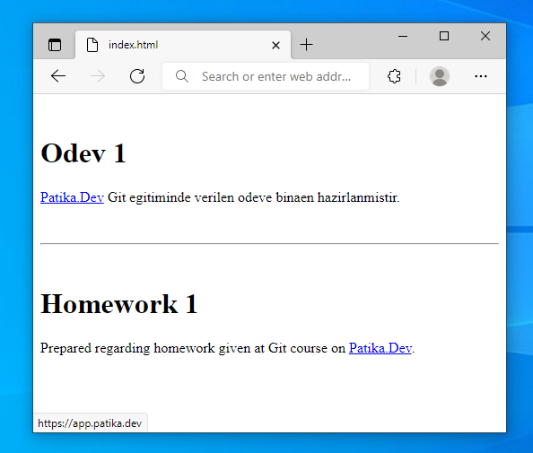

# Kodluyoruz Ilk Repo

Bu repo [Kodluyoruz](https://www.kodluyoruz.org) Front-End Eğitiminde oluşturduğumuz ilk repo. İçerisinde bir adet README dosyası, bir adet de index.html barındırıyor.



## Installation

Öncelikle ana projeyi klonlayın.

```bash
git clone https://github.com/cbugra/patikadev.git
```

## Usage

Projeyi klonladıktan sonra, ödev dizinine geçip Visual Studio Code programında açınız.

Linux için:
```linux
cd patikadev/modules/git/homework_01
code .
```

## Contributing
Pull requestler kabul edilir. Büyük değişiklikler için, lütfen önce neyi değiştirmek istediğinizi tartışmak için bir konu açınız.


## License
[MIT](https://choosealicense.com/licenses/mit/)