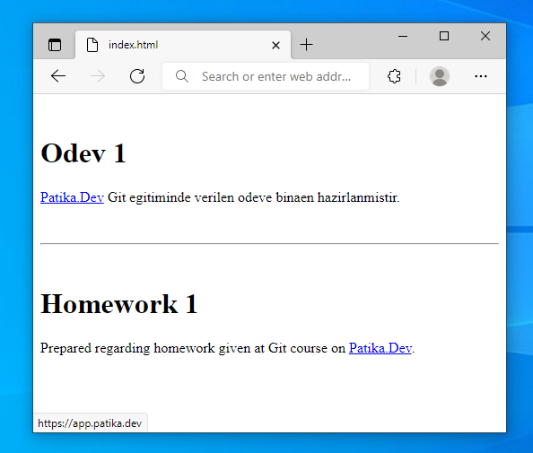

# Kodluyoruz Ilk Repo

Bu repo [Kodluyoruz](https://www.kodluyoruz.org) Front-End Eğitiminde oluşturduğumuz ilk repo. İçerisinde bir adet README dosyası, bir adet de `index.html` barındırıyor.



## İndirme

Öncelikle ana projeyi klonlayın.

```bash
git clone https://github.com/cbugra/patikadev.git
```

## Düzenleme

Projeyi klonladıktan sonra, ödev dizinine geçip editor programında açınız.

Linux için VS Code örneği:
```bash
cd patikadev/modules/git/odev1
code .
```

## License
[MIT](https://choosealicense.com/licenses/mit/)