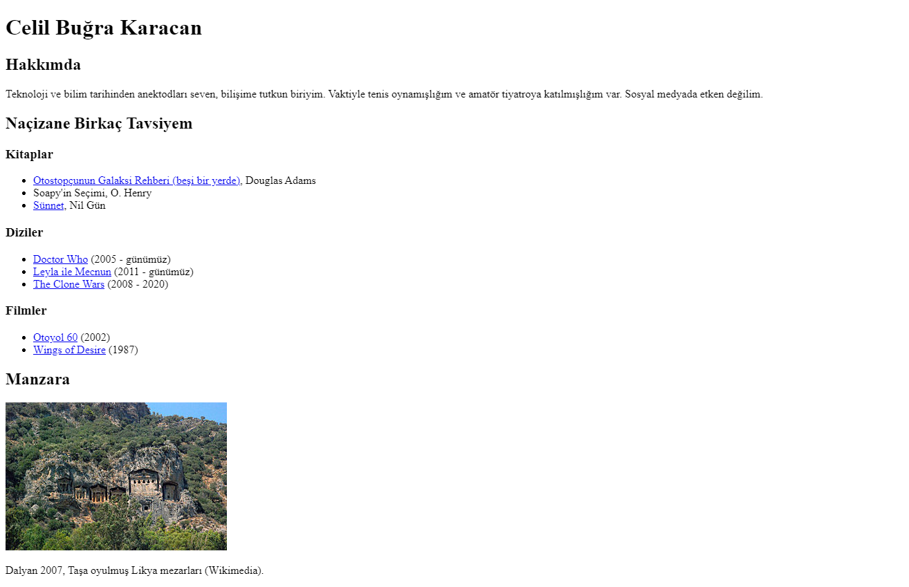

# Kişisel Sayfamızı Detaylandırmaya Devam Etmek

Patika.dev, HTML modülündeki [Ödev 2](https://app.patika.dev/moduller/html/odev1).



## İndirme

Öncelikle ana projeyi klonlayın.

```bash
git clone https://github.com/cbugra/patikadev.git
```

## Düzenleme

Projeyi klonladıktan sonra, ödev dizinine geçip Visual Studio Code programında açınız.

Linux için:
```linux
cd patikadev/modules/html/homework_02
code .
```

## License
[MIT](https://choosealicense.com/licenses/mit/)