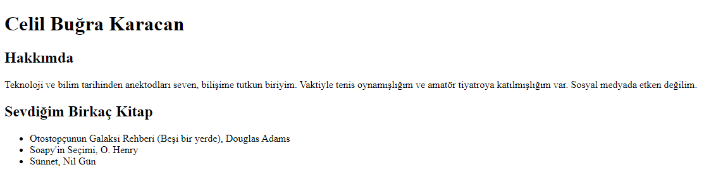

# İlk Web Sayfamızı Oluşturmak

Patika.dev, HTML modülündeki [Ödev 1](https://app.patika.dev/moduller/html/odev1).



## İndirme

Öncelikle ana projeyi klonlayın.

```bash
git clone https://github.com/cbugra/patikadev.git
```

## Düzenleme

Projeyi klonladıktan sonra, ödev dizinine geçip editor programında açınız.

Linux için VS Code örneği:
```bash
cd patikadev/modules/html/odev1
code .
```

## License
[MIT](https://choosealicense.com/licenses/mit/)